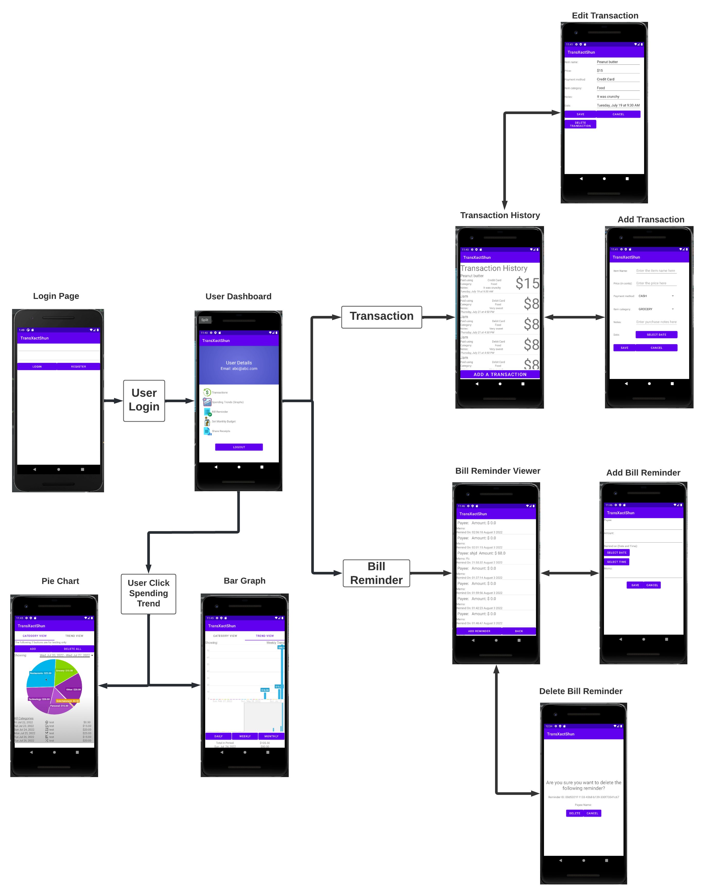
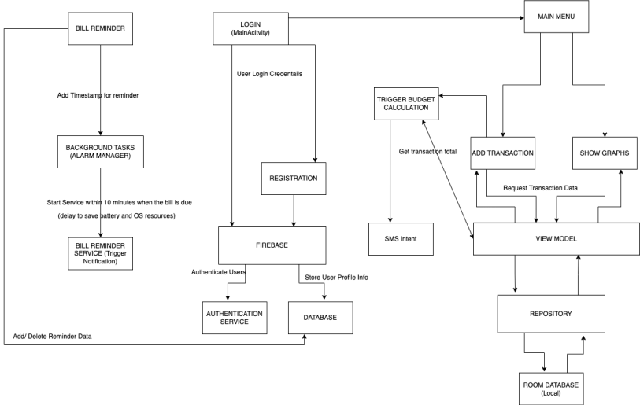
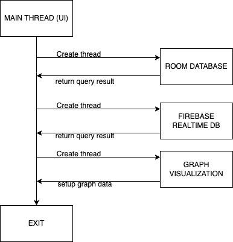

# TransXactShun

TransXactShun is the next generation application integrating state-of-the-art cloud service to deliver an unmatched personal finance experience to our users.

## Meet the Team

### **Michael Chang**

- Maintaining the project source code.
- Worked on adding transaction feature.
- Creating the project website.

### **Avril Gill**

- Integrating firebase to store user data.
- Worked on login feature, budget and bill reminder feature.
- Improving the app’s UI.

### **Eric Liu**

- Worked on the graph visualization feature for showing the transaction data.
- Implementing transaction database in SQLite.
- Worked on features for transaction history and editing transaction.

### **Jason Combs**

- Started the transaction history feature.
- Designed early UI for listing transaction data.
- Implemented add & edit transactions and worked on delete transaction.

## UI Mock Up

## MVVM Model

## Thread Design Model

## References

Firebase auth reference taken from official documentation
Link: https://firebase.google.com/docs/auth/android/start

File: Drawable-> gradient_background.xml
Creating gradient background for main menu 
Link: https://learntodroid.com/how-to-add-a-gradient-background-to-an-android-app/

File: Drawable-> icon_*
All icons downloaded from https://icons8.com/icons/set/popular

File: bills -> BillReminderService
Reference taken for displaying notifications from Lecture 13: BindDemoKotlin
Link: https://www.sfu.ca/~xingdong/Teaching/CMPT362/code/Kotlin_code/BindDemoKotlin.zip
modified according to use case

Util library referenced from Lecture 2 CameraDemoKotlin app
Link: https://www.sfu.ca/~xingdong/Teaching/CMPT362/code/Kotlin_code/CameraDemoKotlin.zip
Modifications were made to include Send SMS

App Logo created using https://www.adobe.com/express/create/logo